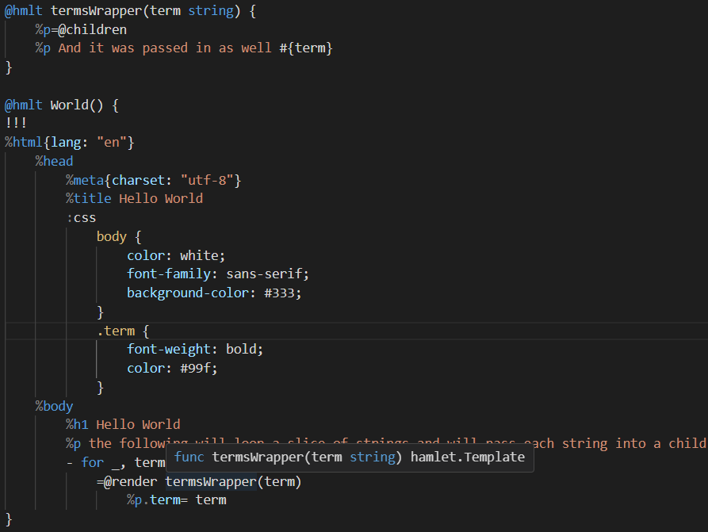

# GoHT (Go HTML Templates)
A [Haml](http://haml.info/), [Slim](https://slim-template.github.io/), and EGO template engine and file generation tool for Go.


[](https://goreportcard.com/report/github.com/stackus/goht)
[](https://pkg.go.dev/github.com/stackus/goht)
[](https://coveralls.io/github/stackus/goht?branch=main)

## Table of Contents
- [Features](#features)
- [Quick Start](#quick-start)
- Template Engines
  - Haml: [Supported Haml Syntax & Features](#supported-haml-syntax--features)
    - [Unsupported Haml Features](#unsupported-haml-features)
  - Slim: [Supported Slim Syntax & Features](#supported-slim-syntax--features)
    - [Unsupported Slim Features](#unsupported-slim-features)
  - EGO: [Supported EGO tags](#supported-ego-tags)
- [GoHT CLI](#goht-cli)
- [IDE Support](#ide-support)
  - [LSP](#lsp)
- [Library Installation](#library-installation)
- [Using GoHT](#using-goht)
  - [Using GoHT with HTTP handlers](#using-goht-with-http-handlers)
  - [A big nod to Templ](#a-big-nod-to-templ)
- [The GoHT template](#the-goht-template)
- [GoHT Syntax](#goht-syntax)
  - [GoHT template differences](#goht-template-differences)
    - [Go package and imports](#go-package-and-imports)
    - [Multiple templates per file](#multiple-templates-per-file)
    - [Doctypes](#doctypes)
    - [Inlined code](#inlined-code)
    - [Rendering code](#rendering-code)
    - [Attributes](#attributes)
    - [Classes](#classes)
    - [Object References](#object-references)
    - [Inlined Tags](#inlined-tags)
    - [Filters](#filters)
    - [Template nesting](#template-nesting)
- [Contributing](#contributing)
- [License](#license)

## Features
- Full [Haml](http://haml.info/) language support 
- Full [Slim](https://slim-lang.com/) language support
- EGO support ([EJS](https://ejs.co/) or [ERB](https://docs.ruby-lang.org/en/2.3.0/ERB.html) like syntax)
- Templates are compiled to type-safe Go and not parsed at runtime
- Multiple templates per file
- Mix Go and templates together in the same file
- Easy nesting of templates

## Quick Start
First create a GoHT file, a file which mixes Go and Haml (and Slim!) with a `.goht` extension:
```haml
package main

var siteTitle = "GoHT"

@haml SiteLayout(pageTitle string) {
  !!!
  %html{lang:"en"}
    %head
      %title= siteTitle
    %body
      %h1= pageTitle
      %p A type-safe HAML template engine for Go.
      = @children
}

@slim HomePage() {
  = @render SiteLayout("Home Page")
    p This is the home page for GoHT.
}

@ego ListItemFragment(item Item) {
	<li>
		<a href="<%= item.URL %>">
			<%= item.Name %>
		</a>
	</li>
}
```

Your next step will be to process the GoHT file to parse the GoHT code and generate the Go code using the GoHT [CLI](#goht-cli) tool:
```sh
goht generate
```

Use the generated Go code to render HTML in your application:
```go
package main

import (
  "fmt"
  "log"
  "net/http"
)

func main() {
  http.HandleFunc("/", func(w http.ResponseWriter, r *http.Request) {
    _ = HomePage().Render(r.Context(), w)
  })

  fmt.Println("Server starting on port 8080...")
  if err := http.ListenAndServe(":8080", nil); err != nil {
    log.Fatal(err)
  }
}
```
Which would serve the following HTML:
```html
<!DOCTYPE html>
<html lang="en">
  <head>
    <title>GoHT</title>
  </head>
  <body>
    <h1>Home Page</h1>
    <p>A type-safe Haml template engine for Go.</p>
    <p>This is the home page for GoHT.</p>
  </body>
</html>
```

## Supported Haml Syntax & Features
- [x] Doctypes (`!!!`)
- [x] Tags (`%tag`)
- [x] Attributes (`{name: value}`) [(more info)](#attributes)
- [x] Classes and IDs (`.class`, `#id`) [(more info)](#classes)
- [x] Object References (`[obj]`) [(more info)](#object-references)
- [x] Unescaped Text (`!` `!=`)
- [x] Comments (`/` `-#`)
- [x] Self-closing Tags (`%tag/`)]
- [x] Inline Interpolation (`#{value}`)
- [x] Inlining Code (`- code`)
- [x] Rendering Code (`= code`)
- [x] Filters (`:plain`, ...) [(more info)](#filters)
- [x] Long Statement wrapping (`\`), (`,`)
- [x] Whitespace Removal (`%tag>`, `%tag<`) [(more info)](#whitespace-removal)

### Unsupported Haml Features
- [ ] Probably something I've missed, please raise an issue if you find something missing.

## Supported Slim Syntax & Features
- [x] Doctypes (`doctype`)
- [x] Tags (`tag`)
- [x] Attributes (`{name: value}`) [(more info)](#attributes)
- [x] Classes and IDs (`.class`, `#id`) [(more info)](#classes)
- [x] Inline Tags (`tag: othertag`)
- [x] Unescaped Text (`|`)
- [x] Comments (`/`, `/!`)
- [x] Self-closing Tags (`tag/`)
- [x] Inline Interpolation (`#{value}`)
- [x] Inlining Code (`- code`)
- [x] Rendering Code (`= code`, `== code`)
- [x] Filters (`:javascript`, `:css`) [(more info)](#filters)
- [x] Long Statement wrapping (`\`), (`,`)
- [x] Whitespace Addition (`tag<` `tag>`) [(more info)](#whitespace-addition)

### Unsupported Slim Features

- [ ] Probably something I've missed, please raise an issue if you find something missing.

### Supported EGO tags

The basic EGO syntax is to start tags and with `<%` and end with `%>`.

The opening tags that are supported are:
- `<%` - Start of a Go code block
	- Examples: `<% for k, v := range list { %>`, `<% foo := "bar" %>`, `<% if foo == "bar" { %>`
- `<%-` - Start of a Go code block with whitespace stripping
	- Examples: `<%- for k, v := range list { %>`, `<%- foo := "bar" %>`, `<%- if foo == "bar" { %>`
- `<%=` - Start of a Go output block; supports the formatting directives like `%d`, `%v`, etc.
	- Examples: `<%= unsafeHTML %>`, `<%= %t someBool %>`, `<%= props.Value %>`
- `<%!` - Start of a Go unescaped output block; supports the formatting directives like `%d`, `%v`, etc.
	- Examples: `<%! safeHTML %>`, `<%! %t someBool %>`, `<%! props.Value %>`
- `<%@` - Start of a command block; Either `@render` or `@children`
	- Examples: `<%@ render ExampleChild(props ChildProps) { %>`, `<%@ children %>`

The closing tags that are supported are:
- `%>` - Normal closing tag
	- Examples: `<% foo := "bar" %>`, `<%= foo %>`
- `-%>` - Closing tag with whitespace stripping
	- Examples: `<% foo := "bar" -%>`, `<%= foo -%>`
- `$%>` - Closing tag with newline stripping (one newline)
	- Examples: `<% foo := "bar" $%>`, `<%= foo $%>`

## GoHT CLI

### Installation
```sh
go install github.com/stackus/goht/cmd/goht@latest
```

### Usage
Use `generate` to generate Go code from GoHT template files,
that are new or newer than the generated Go files, in the current directory and subdirectories:
```sh
goht generate
```
Use the `--path` flag to specify a path to generate code for:
```sh
goht generate --path=./templates
```
In both examples, the generated code will be placed in the same directory as the template files.

Use the `--force` to generate code for all GoHT template files, even if they are older than the generated Go files:
```sh
goht generate --force
```
See more options with `goht help generate` or `goht generate -h`.

## IDE Support

> Note: The IDE extensions are being worked on to add the new Slim syntax highlighting.


- VSCode [Extension](https://marketplace.visualstudio.com/items?itemName=stackus.goht-vscode) and code [repository](https://github.com/stackus/goht-vscode)
- JetBrains (GoLand and others) [Plugin](https://plugins.jetbrains.com/plugin/23783-goht) and code [repository](https://github.com/stackus/goht-jetbrains)
- [TextMate Bundle](bundle)
  - Offers only basic syntax highlighting and is a work in progress.

### LSP
The GoHT CLI has been updated to include an LSP server.
See `goht help lsp` for more information.
This will enable development of extensions and plugins for GoHT in various editors and IDEs.

Contributions are welcome. Please see the [contributing guide](CONTRIBUTING.md) for more information.


## Library Installation
When you are using GoHT you will typically be dealing with the generated Go code, and not the GoHT runtime directly.
However, if you need to install the GoHT library, you can do so with:
```sh
go get github.com/stackus/goht
```

## Using GoHT
To start using GoHT, the first step is to create a GoHT file with one or more Haml templates.
If you need guidance, the section [The GoHT template](#the-goht-template) has all the information you need.

With your GoHT files written, the next step involves generating Go code from them.
The [CLI](#goht-cli) tool handles this generation step.
It's a straightforward process that converts your GoHT files and templates into ready to run Go files.

Each generated Go file will include a function corresponding to each of your templates.
The names of the functions are not altered at all,
if you want them to be exported in Go then you need to use an uppercase letter for the first character of the template name.

When this function is executed, it yields a `*goht.Template`.
This is what you'll use to render your templates in the application.

```go
package main

import (
  "context"
  "os"

  "github.com/stackus/goht/examples/tags"
)

func main() {
  tmpl := tags.RemoveWhitespace()

  err := tmpl.Render(context.Background(), os.Stdout)
  if err != nil {
    panic(err)
  }
}
```
The above would render the `RemoveWhitespace` example from the [examples](/examples) directory in this repository,
and would output the following:
```html
<p>This text has no whitespace between it and the parent tag.</p>
<p>
There is whitespace between this text and the parent tag.<p>This text has no whitespace between it and the parent tag.
There is also no whitespace between this tag and the sibling text above it.
Finally, the tag has no whitespace between it and the outer tag.</p></p>
```
The second parameter passed into the `Render` method can be anything that implements the `io.Writer` interface,
such as a file or a buffer, or the `http.ResponseWriter` that you get from an HTTP handler.

### Using GoHT with HTTP handlers
Using the GoHT templates is made straightforward.
```go
package main

import (
  "fmt"
  "log"
  "net/http"

  "github.com/stackus/goht/examples/hello"
)

func main() {
  http.HandleFunc("/", func(w http.ResponseWriter, r *http.Request) {
    _ = hello.World().Render(r.Context(), w)
  })

  fmt.Println("Server starting on port 8080...")
  if err := http.ListenAndServe(":8080", nil); err != nil {
    log.Fatal(err)
  }
}
```

**More Examples!**

There are a number of examples showing various template features in the [examples](examples) directory.

### A big nod to Templ
The way that you use GoHT is very similar to how you would use [Templ](https://templ.guide). This is no accident as I am a big fan of the work being done with that engine.

After getting the Haml properly lexed and parsed, I did not want to reinvent the wheel and come up with a whole new rendering API.
The API that Templ presents is nice and easy to use, so I decided to replicate it in GoHT.

## The GoHT template
GoHT templates are files with the extension `.goht` that when processed will produce a matching Go file with the extension `.goht.go`.

In these files you are free to write any Go code that you wish, and then drop into Haml mode using the `@haml` directive.

> Note: The original `@goht` directive is still supported for HAML templating, but it is deprecated and will be removed in a future version.

The following starts the creation of a SiteLayout template:
```haml
@haml SiteLayout() {

or

@slim SiteLayout() {

or

@ego SiteLayout() {
```

GoHT templates are closed like Go functions, with a closing brace `}`. So a complete but empty example is this:
```haml
@haml SiteLayout() {
}

or

@slim SiteLayout() {
}

or

@ego SiteLayout() {
}
```
Inside the templates you must indent the contents of the template code at least once. This is a requirement of GoHT.

## GoHT Syntax
The Haml syntax is documented at the [Haml](http://haml.info/) website.
Please see that site or the [Haml Reference](https://haml.info/docs/yardoc/file.REFERENCE.html) for more information.
The Slim syntax is documented at the [Slim](https://slim-lang.com/) website.

GoHT has implemented nearly all Haml and Slim syntax that are whitespace indented syntaxes. It also supports the EGO syntax which is a syntax more like normal HTML.
So, if you are already familiar with Haml, Slim, or are familiar with either EJS (Embedded JavaScript) or ERB (Embedded Ruby) then you should be able to jump right in.
There are some minor differences that I will document in the next section.

### GoHT template differences

Important differences are:
- [Go package and imports](#go-package-and-imports): You can declare a package and imports for your templates.
- [Multiple templates per file](#multiple-templates-per-file): You can declare as many templates in a file as you wish.
- [Doctypes](#doctypes): Haml and Slim only. Limited doctype support.
- [Indents](#indents): GoHT follows the rules of GoFMT for indents.
- [Inlined code](#inlined-code): You won't be using Ruby here, you'll be using Go.
- [Rendering code](#rendering-code): The catch is what is being outputted will need to be a string in all cases.
- [Attributes](#attributes): Haml and Slim only. Only the Ruby 1.9 (`{...}`) style of attributes is supported.
- [Classes](#classes): Haml and Slim only. Multiple sources of classes are supported.
- [Object References](#object-references): Haml Only: Limited support for object references.
- [Filters](#filters): Haml and Slim only. Partial list of supported filters.
- [Template nesting](#template-nesting): Templates can be nested, and content can be passed into them.

In the above list, EGO doesn't have many of the limitations of the other two languages.
This is because anything outside the EGO tags can be or contain whatever you want.

### Go package and imports
You can provide a package name at the top of your GoHT template file. If you do not provide one then `main` will be used.

You may also import any packages that you need to use in your template. The imports you use and the ones brought in by GoHT will be combined and deduplicated.

### Multiple templates per file
You can declare as many templates in a file as you wish.
Each template must have a unique name in the module they will be output into.
You may also mix all three template types in the same file.
```haml
@slim SiteLayout() {
}

@haml HomePage() {
}

@ego ListItem(item Item) {
}
```

The templates are converted into Go functions, so they must be valid Go function names.
This also means that you can declare them with parameters and can use those parameters in the template.
```haml
@haml SiteLayout(title string) {
  !!!
  %html{lang:"en"}
    %head
      %title= title
    %body
      -# ... the rest of the template
}
```
The same applies to Slim templates:
```slim
@slim SiteLayout(title string) {
  doctype html
  html(lang="en")
    head
      title= title
    body
      / ... the rest of the template
}
```
And to the EGO templates:
```html
@ego SiteLayout(title string) {
	<html lang="en">
		<head>
			<title><%= title %></title>
		</head>
		<body>
			<!-- ... the rest of the template -->
		</body>
	</html>
}
```

### Doctypes
Only the HTML 5 doctype is supported in the Haml and Slim templates, and is written using `!!!` or `doctype`.
```haml
@haml SiteLayout() {
  !!!
}

@slim SiteLayout() {
  doctype
}
```

### Indents
GoHT follows the rules of GoFMT for indents, meaning that you should use tabs for indentation.
For the Haml and Slim templates, you must use tabs throughout the entire template.
For the EGO templates, you may use spaces after the initial tab indent required for each line.

> Note: Two spaces are being used in this README for display only. Keep that in mind if you copy and paste the examples from this document.

You must also indent the content of the Haml and Slim templates,
and the closing brace should be at the same level as the template directive.
```haml
@haml SiteLayout() {
  %html
    %head
      %title GoHT
    %body
      %h1 GoHT
}
```

Slim:
```slim
@slim SiteLayout() {
  doctype
  html
    head
      title GoHT
    body
      h1 GoHT
}
```

EGO:
```html
@ego SiteLayout() {
	<html>
		<head>
			<title>GoHT</title>
		</head>
		<body>
			<h1>GoHT</h1>
		</body>
	</html>
}
```

### Inlined code
You won't be using Ruby here, you'll be using Go.

In most situations where we would need to include opening and closing braces in Go, we can omit them in GoHT.
This makes it a lot closer to the Ruby-based Haml, and makes the templates easier to read.
Go will still require that we have a full statement, no shorthands for boolean conditionals.
So instead of this with Ruby:
```haml
  - if user
    %strong The user exists
```
You would write this with Go (Go needs the `!= nil` check):
```haml
  - if user != nil
    %strong The user exists
```
There is minimal processing performed on the Go code you put into the templates, so it needs to be valid Go code sans braces.

> You may continue to use the braces in the Haml and Slim templates at the ends of your lines if you wish. Existing code with braces will continue to work without modifications.

Long statements can be split across multiple lines by ending each line with either a backslash `\` or a comma `,`.
The backslashes will be **stripped**, but the commas will be **kept**.

```haml
  - if user != nil && user.Name != ""\
    && user.Age > 0
    %strong The user is not empty
```

You can also spread statements across multiple lines in the EGO templates.
Take care that the code is valid Go code because the entire statement, with newlines and whitespace, is all captured.

```html
@ego SiteLayout() {
	<% if user != nil && 
		user.Name != "" { %>
		<strong>The user is not empty</strong>
	<% } %>
}
```

### Rendering code
Like in Haml, you can output variables and the results of expressions. The `=` script syntax and text interpolation `#{}` are supported for both template languages.
```haml
  %strong= user.Name
  %strong The user's name is #{user.Name}
```
Slim:
```slim
  strong= user.Name
  strong The user's name is #{user.Name}
```

The catch is what is being outputted will need to be a string in all cases.
So instead of writing this to output an integer value:
```haml
  %strong= user.Age
```
You would need to write this:
```haml
  %strong= fmt.Sprintf("%d", user.Age)
```
Which, to be honest, can be a bit long to write, so a shortcut is provided:
```haml
  %strong=%d user.Age
```
The interpolation syntax also supports the shortcut:
```haml
  %strong #{user.Name} is #{%d user.Age} years old.
```
When formatting a value into a string `fmt.Sprintf` is used under the hood, so you can use any of the formatting options that it supports.

### Attributes
**Haml and Slim Only**

**Only the Ruby 1.9 style of attributes is supported.**

This syntax is closest to the Go syntax, and is the most readable.
Between the attribute name, operator, and value you can include or leave out as much whitespace as you like.
```haml
  %a{href: "https://github.com/stackus/goht", target: "_blank"} GoHT
```
You can supply a value to an attribute using the text interpolation syntax.
```haml
  %a{href:#{url}} GoHT
```
Attributes can be written over multiple lines, and the closing brace can be on a new line.
```haml
  %a{
    href: "...",
    target: "_blank",
  } GoHT
```
Attributes which you want to render conditionally use the `?` operator instead of the `:` operator.
For conditional attributes the attribute value is required to be an interpolated value which will be used as the condition in a Go `if` statement.
```haml
  %button{
    disabled ? #{disabled},
  } Click me
```
> Note: The final comma is not required on the last attribute when they are spread across multiple lines like it would be in Go. Including it is fine and will not cause any issues.

Certain characters in the attribute name will require that the name be escaped.
```haml
  %button{
    "@click": "onClick",
    ":disabled": "disabled",
  } Click me
```
Keep in mind that attribute names cannot be replaced with an interpolated string; only the value can.

To support dynamic lists of attributes, you can use the `@attributes` directive.
This directive takes a list of arguments which comes in two forms:
- `map[string]string`
  - The key is the attribute name, the value is the attribute value.
  - The attribute will be rendered if the value is not empty.
- `map[string]bool`
  - The key is the attribute name, the value is the condition to render the attribute.
```haml
  %button{
    "@click": "onClick",
    ":disabled": "disabled",
    @attributes: #{myAttrs},
  } Click me
```
### Classes
**Haml and Slim Only**

GoHT supports the `.` operator for classes and also will accept the `class` attribute such as `class:"foo bar"`.
However, if the class attribute is given an interpolated value, it will need to be a comma separated list of values.
These values can be the following types:
- `string`
  - `myClass` variable or `"foo bar"` string literal
- `[]string`
  - Each item will be added to the class list if it is not blank.
- `map[string]bool`
  - The key is the class name, the value is the condition to include the class.

Examples:
```haml
  %button.foo.bar.baz Click me
  %button.fizz{class:"foo bar baz"} Click me
  %button.foo{class:#{myStrClasses, myBoolClasses}} Click me
```
All sources of classes will be combined and deduplicated into a single class attribute.

### Object References
**Haml Only**

Haml supports using a Ruby object to supply the id and class for a tag using the `[]` object reference syntax.

This is supported but is rather limited in GoHT.
The type that you use within the brackets will be expected to implement at least one or both of the following interfaces:
```go
type ObjectIDer interface {
  ObjectID() string
}

type ObjectClasser interface {
  ObjectClass() string
}
```
The result of these methods will be used
to populate the id and class attributes in a similar way to how Haml would apply the Ruby object references.

### Inlined Tags
**Slim Only**

GoHT supports inlining tags to keep templates as compact as possible.

```slim
  ul
    li: a.First Fist Item
    li: a.Second Second Item
    li: a.Third Third Item
```

### Filters
Only the following Haml filters are supported:
- `:plain` (Haml Only)
- `:escaped` (Haml Only)
- `:preserve` (Haml Only)
- `:javascript`
- `:css`

### Whitespace Removal
**Haml Only**

GoHT supports the removal of whitespace between tags. This is done by adding a `>` or `<` to the end of the tag.

- `>` will remove all whitespace between the tag and its parent or siblings.
- `<` will remove all whitespace between the tag and its first and last child.

Both can be used together to remove whitespace both inside and outside a tag; the order they're in does not matter.

### Whitespace Addition
**Slim Only**

GoHT supports the addition of whitespace between tags. This is done by adding a `<` or `>` to the end of the tag.

- `<` will add whitespace before the tag
- `>` will add whitespace after the tag

### Template nesting
The biggest departure from Haml is how templates can be combined. When working Haml you could use `= render :partial_name` or `= haml :partial_name` to render a partial. The `render` and `haml` functions are not available in GoHT, instead you can use the `@render` directive.
```haml
@haml HomePage() {
  = @render SiteLayout()
}
```
The above would render the `SiteLayout` template, and you would call it with any parameters that it needs. You can also call it and provide it with a block of content to render where it chooses.
```haml
@haml HomePage() {
  = @render SiteLayout()
    %p This is the home page for GoHT.
}
```
Any content nested under the `@render` directive will be passed into the template that it can render where it wants using the `@children` directive.
```haml
@haml SiteLayout() {
  !!!
  %html{lang:"en"}
    %head
      %title GoHT
    %body
      %h1 GoHT
      %p A HAML-like template engine for Go.
      = @children
}
```

## Contributing
Contributions are welcome. Please see the [contributing guide](CONTRIBUTING.md) for more information.

## License
[MIT](LICENSE)
